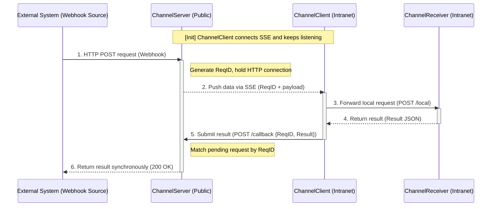
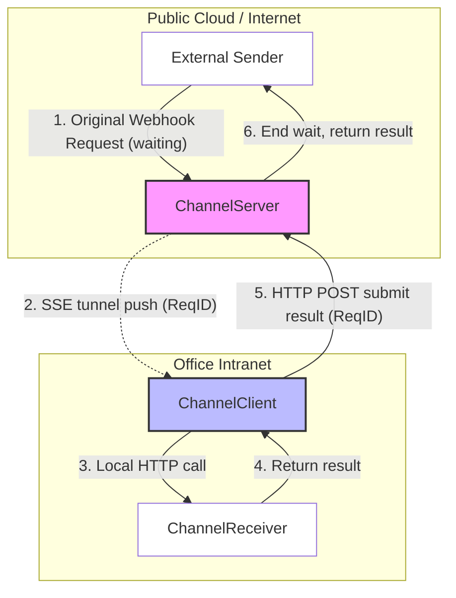
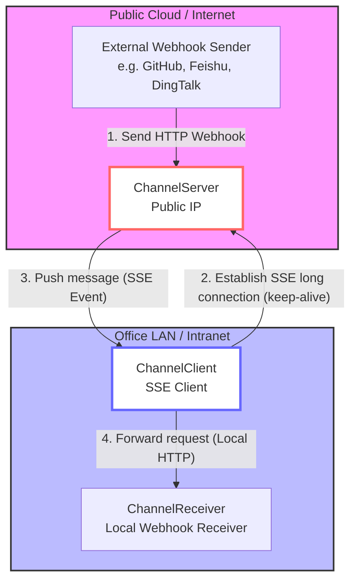
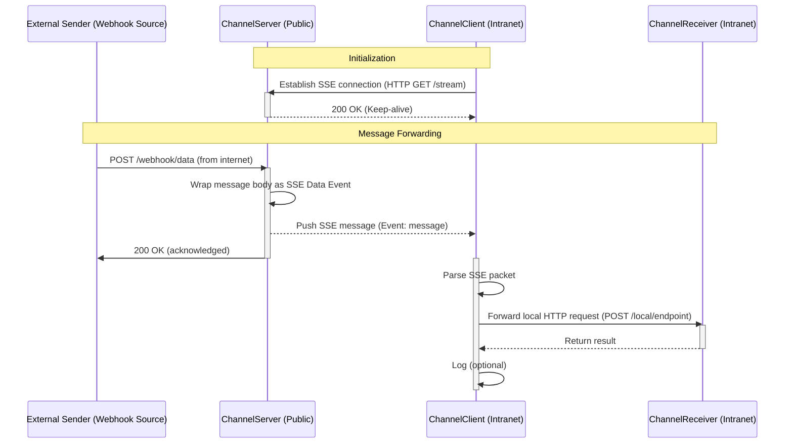

# LinkedBot — Product Requirements Document (PRD)

> 📖 [中文版本 → PRD.zh.md](./PRD.zh.md)

---

## Overview

LinkedBot introduces a **Channel** object (previously called "bot") as the core unit. When creating a new Channel, there are two operating modes:

1. **Proxy Mode**
   - When an external system calls back the Channel's webhook URL, the Channel transparently relays the request to the local client (`Forwarded to localhost:9999/webhook`), waits for the local webhook response, and returns it to the external caller via the client → server path.

2. **Mailbox Mode**
   - When an external system calls back the Channel's webhook URL, the Channel saves the message to the database and immediately replies to the caller with a preset response (e.g. `{"code":"ok"}`). LinkedBot then **asynchronously** delivers the message to the local client process, which forwards it to `localhost:9999/webhook`.

---

## Use Cases

### Scenario 1: Local Development & Payment Callback Debugging

Developers working in an office without a public IP cannot normally receive callbacks from third-party payment systems (e.g., WeChat Pay, Alipay). With LinkedBot, the developer can:

1. Register an account on the LinkedBot website.
2. Create a **Proxy Mode** Channel.
3. Start a local client.

This allows WeChat Pay or Alipay to call back the local webhook without any self-hosted proxy infrastructure — ideal for independent developers.

> **Note**: Most webhooks use HTTP POST.

---

## System Architecture

### Components

| Component | Location | Role |
|-----------|----------|------|
| **ChannelServer** | Cloud / Public IP | Relay / Message hub |
| **ChannelClient** | Office intranet | Intranet tunnel agent |
| **ChannelReceiver** | Office intranet | Final business logic handler |

### Component Responsibilities

**ChannelServer (Public)**
- Provides a public endpoint to receive third-party callbacks.
- Maintains SSE connection pool with ChannelClients.
- Converts received HTTP bodies into SSE events for delivery.

**ChannelClient (Intranet)**
- Initiates connections to the Server (bypasses inbound firewall restrictions).
- Parses SSE event streams.
- Reconstructs data as local HTTP requests sent to ChannelReceiver.

**ChannelReceiver (Local)**
- Runs inside the intranet.
- Handles specific business logic (e.g., parsing alerts, auto deployment, controlling LAN devices, etc.).

---

## Mode 1: Proxy Mode

### Sequence Diagram

### Architecture Topology

### Key Architecture Points

| Point | Description |
|-------|-----------------|
| **ReqID** | ChannelServer must generate a unique ID per webhook call, and include it in SSE messages, so results can be matched back to pending requests. |
| **Request Parking** | The webhook handler must not return immediately; it must await the callback using a Promise/Future/Channel mechanism. |
| **Timeout** | A timeout (e.g., 10–30s) must be set. If no result is received, the server returns `504 Gateway Timeout`. |
| **Return Path** | The client returns results by making a new HTTP POST to the Server's `/api/callback` — SSE is one-way only. |

---

## Mode 2: Mailbox Mode

### Architecture Topology

### Sequence Diagram

---

## References

- Open-source client reference: [webhook.site CLI](https://github.com/webhooksite/cli)