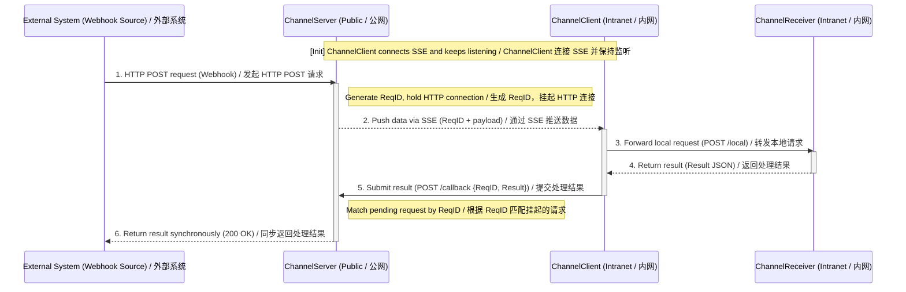
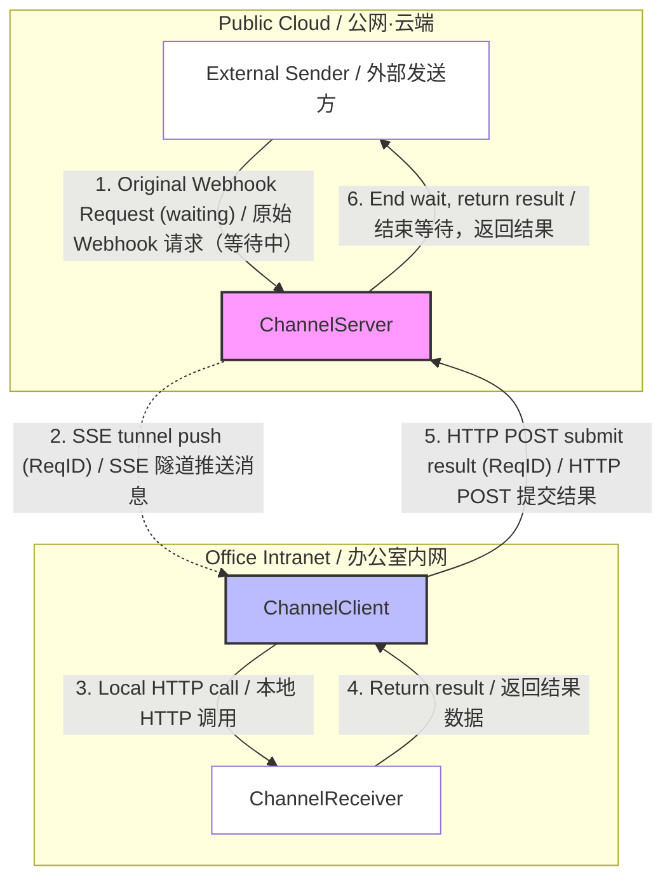
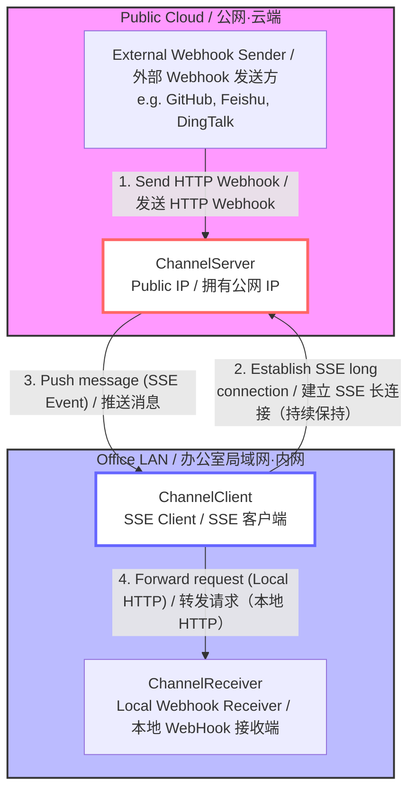
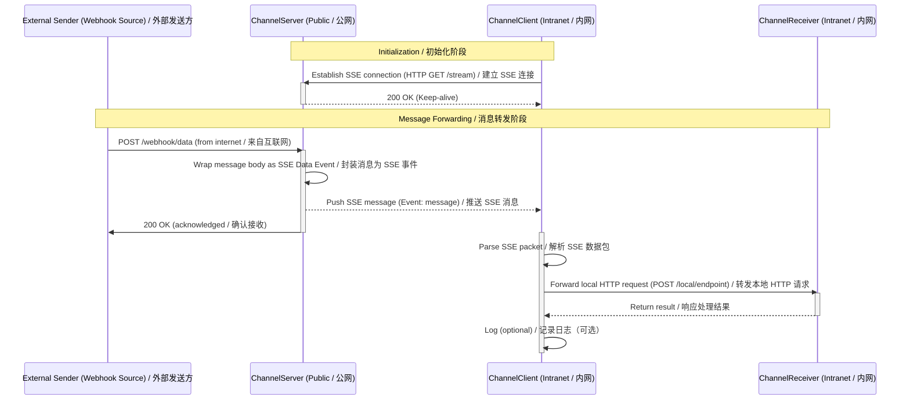

# LinkedBot — Product Requirements Document (PRD)
# LinkedBot — 产品需求文档

---

## Overview / 概述

LinkedBot introduces a **Channel** object (previously called "bot") as the core unit. When creating a new Channel, there are two operating modes:

LinkedBot 使用 **Channel**（频道）对象（之前称为 "bot"）作为核心单元。新建 Channel 时，有两种运行模式：

1. **Proxy Mode / 代理模式**
   - When an external system calls back the Channel's webhook URL, the Channel transparently relays the request to the local client (`Forwarded to localhost:9999/webhook`), waits for the local webhook response, and returns it to the external caller via the client → server path.
   - 当外部系统回调 Channel 的 Webhook 地址时，Channel 将请求透传给本地 Client（`Forwarded to localhost:9999/webhook`），等待本地 Webhook 处理结果后，通过 Client → Server 路径原路返回给外部系统。

2. **Mailbox Mode / 邮箱模式**
   - When an external system calls back the Channel's webhook URL, the Channel saves the message to the database and immediately replies to the caller with a preset response (e.g. `{"code":"ok"}`). LinkedBot then **asynchronously** delivers the message to the local client process, which forwards it to `localhost:9999/webhook`.
   - 当外部系统回调 Channel 的 Webhook 地址时，Channel 将消息保存到数据库，并立即用用户预设的响应（如 `{"code":"ok"}`）回复给外部系统。随后 LinkedBot **异步**将消息投递给用户本地的 Client 进程，Client 再转发给 `localhost:9999/webhook`。

---

## Use Cases / 使用场景

### Scenario 1: Local Development & Payment Callback Debugging / 场景一：本地开发调试支付回调

Developers working in an office without a public IP cannot normally receive callbacks from third-party payment systems (e.g., WeChat Pay, Alipay). With LinkedBot, the developer can:

在没有公网 IP 的办公室环境中，开发者无法直接接收来自微信支付、支付宝等第三方系统的回调。使用 LinkedBot，开发者只需：

1. Register an account on the LinkedBot website. / 在 LinkedBot 网站注册账号。
2. Create a **Proxy Mode** Channel. / 新建一个**代理模式** Channel。
3. Start a local client. / 在本地启动 Client 程序。

This allows WeChat Pay or Alipay to call back the local webhook without any self-hosted proxy infrastructure — ideal for independent developers.

即可让微信支付或支付宝将回调打到本地 Webhook，无需自行搭建代理服务，对独立开发者极为友好。

> **Note / 注意**: Most webhooks use HTTP POST. / 大多数 Webhook 以 HTTP POST 方式发送。

---

## System Architecture / 系统架构

### Components / 组件定义

| Component | Location | Role |
|-----------|----------|------|
| **ChannelServer** | Cloud / Public IP | Relay / 中转站 |
| **ChannelClient** | Office intranet | Intranet tunnel agent / 内网穿透代理 |
| **ChannelReceiver** | Office intranet | Final business logic handler / 最终业务逻辑处理端 |

| 组件 | 位置 | 职责 |
|------|------|------|
| **ChannelServer** | 云端 / 公网 | 消息中转站（Relay） |
| **ChannelClient** | 办公室内网 | 内网穿透代理（Agent） |
| **ChannelReceiver** | 办公室内网 | 最终业务逻辑处理端 |

### Component Responsibilities / 组件职责说明

**ChannelServer (Public / 公网端)**
- Provides a public endpoint to receive third-party callbacks. / 提供公网 Endpoint 接收第三方回调。
- Maintains SSE connection pool with ChannelClients. / 维护与 ChannelClient 的 SSE 连接池。
- Converts received HTTP bodies into SSE events for delivery. / 将收到的 HTTP Body 转换为 SSE Event 推送。

**ChannelClient (Intranet / 内网端)**
- Initiates connections to the Server (bypasses inbound firewall restrictions). / 主动向 Server 发起连接（规避内网防火墙对入站流量的拦截）。
- Parses SSE event streams. / 解析 SSE 事件流。
- Reconstructs data as local HTTP requests sent to ChannelReceiver. / 将数据重新构造为本地 HTTP 请求发给 ChannelReceiver。

**ChannelReceiver (Local / 本地端)**
- Runs inside the intranet. / 运行在内网中。
- Handles specific business logic (e.g., parsing alerts, auto deployment, controlling LAN devices, etc.). / 处理具体的业务逻辑（如：解析告警、自动部署、控制局域网设备等）。

---

## Mode 1: Proxy Mode / 模式一：代理模式

### Sequence Diagram / 时序图

### Architecture Topology / 架构拓扑图

### Key Architecture Points / 架构关键点

| Point | Description (EN) | 说明（中文） |
|-------|-----------------|-------------|
| **ReqID** | ChannelServer must generate a unique ID per webhook call, and include it in SSE messages, so results can be matched back to pending requests. | ChannelServer 接收到外部 Webhook 时必须生成唯一 ReqID 并随 SSE 下发，否则无法关联回传结果与挂起请求。 |
| **Request Parking** | The webhook handler must not return immediately; it must await the callback using a Promise/Future/Channel mechanism. | Webhook 入口函数不能立即返回，需用 Promise / Future / Channel 等机制在内存中"挂起等待"。 |
| **Timeout** | A timeout (e.g., 10–30s) must be set. If no result is received, the server returns `504 Gateway Timeout`. | 必须设置超时（建议 10–30 秒）。超时未收到回传结果时，Server 应返回 `504 Gateway Timeout`。 |
| **Return Path** | The client returns results by making a new HTTP POST to the Server's `/api/callback` — SSE is one-way only. | Client 通过新建 HTTP POST 请求将结果回传给 Server 的 `/api/callback` 接口，因为 SSE 是单向的。 |

---

## Mode 2: Mailbox Mode / 模式二：邮箱模式

### Architecture Topology / 架构拓扑图

### Sequence Diagram / 时序图

---

## References / 参考资料

- Open-source client reference / 开源客户端参考: [webhook.site CLI](https://github.com/webhooksite/cli)