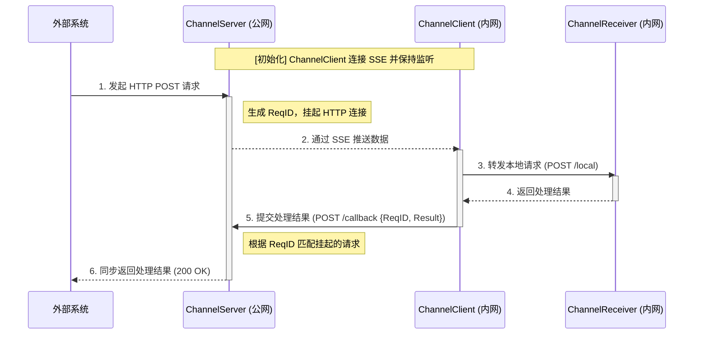
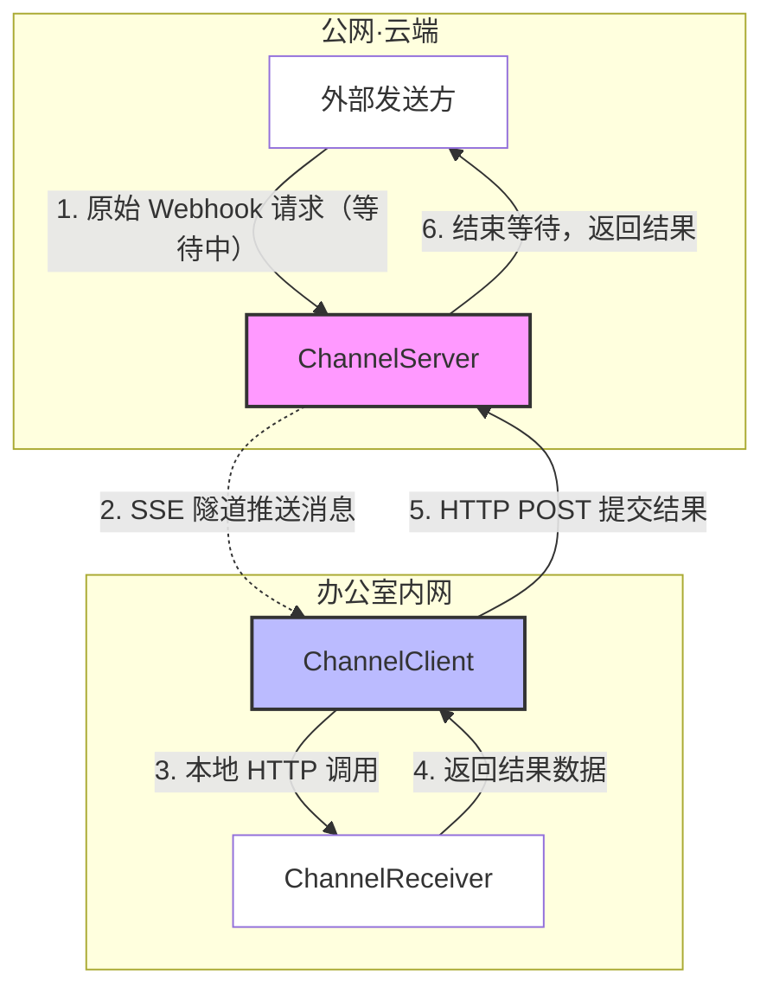
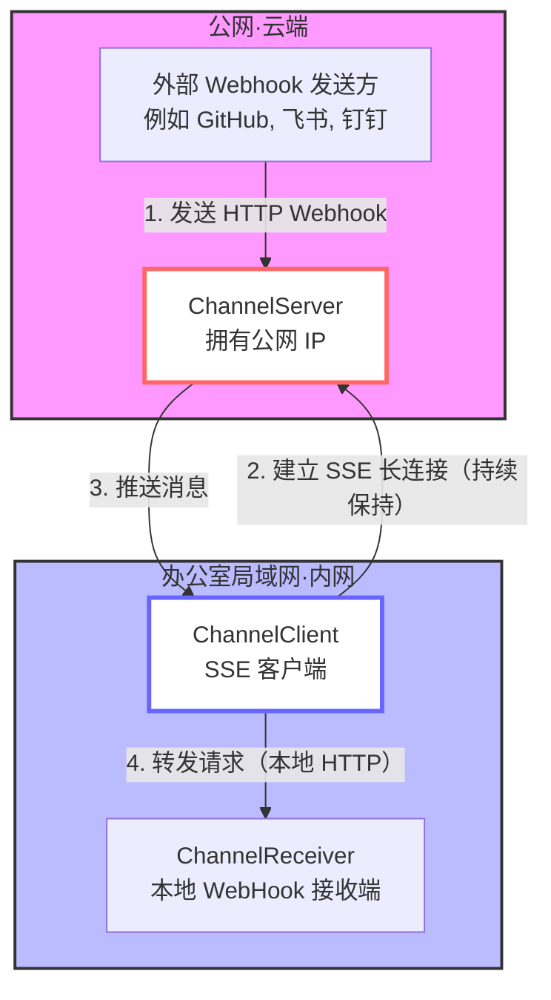
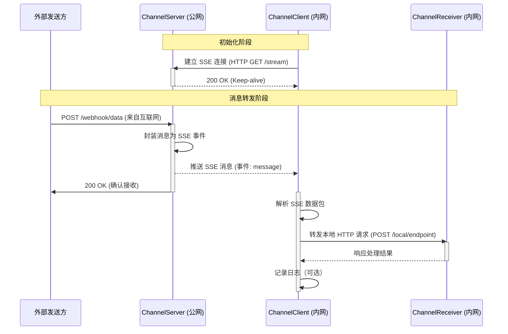

# LinkedBot — 产品需求文档

> 📖 [English Version → PRD.md](./PRD.md)

---

## 概述

LinkedBot 使用 **Channel**（频道）对象（之前称为 "bot"）作为核心单元。新建 Channel 时，有两种运行模式：

1. **代理模式 (Proxy Mode)**
   - 当外部系统回调 Channel 的 Webhook 地址时，Channel 将请求透传给本地 Client（`Forwarded to localhost:9999/webhook`），等待本地 Webhook 处理结果后，通过 Client → Server 路径原路返回给外部系统。

2. **邮箱模式 (Mailbox Mode)**
   - 当外部系统回调 Channel 的 Webhook 地址时，Channel 将消息保存到数据库，并立即用用户预设的响应（如 `{"code":"ok"}`）回复给外部系统。随后 LinkedBot **异步**将消息投递给用户本地的 Client 进程，Client 再转发给 `localhost:9999/webhook`。

---

## 使用场景

### 场景一：本地开发调试支付回调

在没有公网 IP 的办公室环境中，开发者无法直接接收来自微信支付、支付宝等第三方系统的回调。使用 LinkedBot，开发者只需：

1. 在 LinkedBot 网站注册账号。
2. 新建一个**代理模式** Channel。
3. 在本地启动 Client 程序。

即可让微信支付或支付宝将回调打到本地 Webhook，无需自行搭建代理服务，对独立开发者极为友好。

> **注意**: 大多数 Webhook 以 HTTP POST 方式发送。

---

## 系统架构

### 组件定义

| 组件 | 位置 | 职责 |
|------|------|------|
| **ChannelServer** | 云端 / 公网 | 消息中转站（Relay） |
| **ChannelClient** | 办公室内网 | 内网穿透代理（Agent） |
| **ChannelReceiver** | 办公室内网 | 最终业务逻辑处理端 |

### 组件职责说明

**ChannelServer (公网端)**
- 提供公网 Endpoint 接收第三方回调。
- 维护与 ChannelClient 的 SSE 连接池。
- 将收到的 HTTP Body 转换为 SSE Event 推送。

**ChannelClient (内网端)**
- 主动向 Server 发起连接（规避内网防火墙对入站流量的拦截）。
- 解析 SSE 事件流。
- 将数据重新构造为本地 HTTP 请求发给 ChannelReceiver。

**ChannelReceiver (本地端)**
- 运行在内网中。
- 处理具体的业务逻辑（如：解析告警、自动部署、控制局域网设备等）。

---

## 模式一：代理模式

### 时序图

### 架构拓扑图

### 架构关键点

| 关键点 | 说明 |
|-------|-------------|
| **ReqID** | ChannelServer 接收到外部 Webhook 时必须生成唯一 ReqID 并随 SSE 下发，否则无法关联回传结果与挂起请求。 |
| **请求挂起** | Webhook 入口函数不能立即返回，需用 Promise / Future / Channel 等机制在内存中"挂起等待"。 |
| **超时机制** | 必须设置超时（建议 10–30 秒）。超时未收到回传结果时，Server 应返回 `504 Gateway Timeout`。 |
| **回传路径** | Client 通过新建 HTTP POST 请求将结果回传给 Server 的 `/api/callback` 接口，因为 SSE 是单向的。 |

---

## 模式二：邮箱模式

### 架构拓扑图

### 时序图

---

## 参考资料

- 开源客户端参考: [webhook.site CLI](https://github.com/webhooksite/cli)
