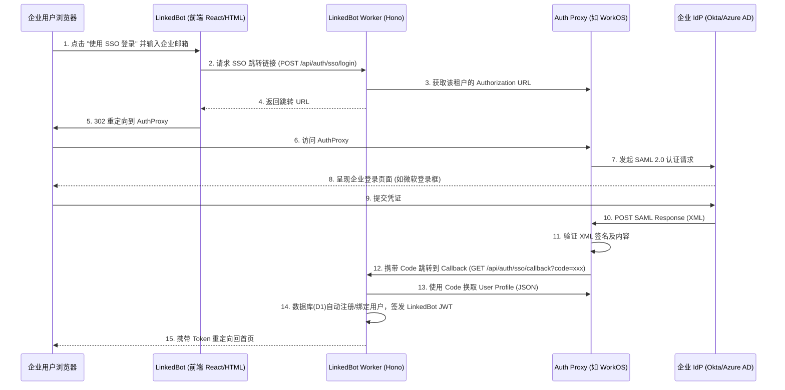

# LinkedBot SAML 2.0 SSO 技术方案

## 1. 背景与目标
LinkedBot 作为一个面向开发者和企业的数据通道(Webhook/Proxy)，随着企业用户的增加，需要支持标准的企业级身份认证协议 SAML 2.0 (Security Assertion Markup Language)，以允许企业用户通过他们现有的 Identity Provider (IdP，如 Okta, Azure AD, 飞书, 钉钉等) 直接单点登录到 LinkedBot。

**主要目标**：
- 支持 SP-Initiated (Service Provider 也就是 LinkedBot 发起的) 登录流程。
- 解析并验证 IdP 返回的 SAML Assertion。
- 自动为首次登录的 SSO 用户在 LinkedBot 系统中分配/创建账号。
- 与现有的 JWT 认证体系打通。

## 2. 架构痛点与技术挑战
LinkedBot 的核心运行在 **Cloudflare Workers** (Edge 环境) 上。
**痛点**：Cloudflare Workers 不是标准的 Node.js 环境，缺少核心的 `crypto` 和 `fs` 模块，而传统的 SAML 解析库（如 `passport-saml`, `samlify`）深度依赖 Node.js 的原生模块进行 XML 解析和 RSA-SHA256 签名验证，这导致无法在 Worker 环境中直接安装使用这些主流库。

## 3. 技术选型建议
为了在 Cloudflare 环境下支持 SAML 2.0，有以下三种可选方案：

### 方案 A：使用第三方 Auth 代理层（推荐方案，如 WorkOS / Auth0 / Clerk）
将复杂的 SAML XML 解析、证书验证和元数据管理交给专业的 B2B Auth SaaS。
- **流程**：LinkedBot -> 跳转到 WorkOS/Auth0 -> 跳转到企业 IdP -> 企业 IdP 返回 XML 给 WorkOS -> WorkOS 解析并转换为标准的 OIDC/JWT 返回给 LinkedBot Worker。
- **优点**：完美避开 Cloudflare Workers 解析 XML 的限制；支持不仅是 SAML，还能同时支持 OIDC；免除企业 IdP 繁琐的配置指导。
- **缺点**：有外部依赖和额外的 SaaS 费用。

### 方案 B：Cloudflare Zero Trust (Access)
使用 Cloudflare 自身的 Access 服务作为 IdP 代理。
- **流程**：在 Cloudflare Access 中配置 SAML IdP。用户访问时，Cloudflare Edge 会自动拦截并进行 SAML 认证，认证通过后向 Worker 传递 `Cf-Access-Jwt-Assertion` header。
- **优点**：最贴合当前技术栈，无缝集成，安全性极高。
- **缺点**：与 Cloudflare 强绑定，如果是给 SaaS 客户提供独立域名的 SSO 配置会比较受限。

### 方案 C：纯 Worker 原生实现 (WebCrypto + XML-DOM)
在 Worker 内部实现精简版的 SAML 解析。
- **实现方式**：使用 `xmldom` 的纯 JS 版本解析 XML 树，并使用 Web Crypto API (`crypto.subtle`) 来进行 RSA 证书验签。
- **优点**：无第三方依赖，数据完全内部闭环。
- **缺点**：开发难度大，XML 签名机制（XMLDsig）极其复杂，容易存在安全漏洞（如 XML Signature Wrapping 攻击）。

---
**本设计方案选取【方案 A (使用 WorkOS/Auth0 等 OIDC 桥接)】来输出具体的架构设计。因为这是现代 SaaS 产品的通用做法，开发成本低且安全性有保障。**

## 4. 详细架构设计 (基于 OIDC 桥接方案)

### 4.1 核心交互流程


### 4.2 数据库 Schema 设计 (D1)
需要对现有的 `users` 和 `organizations` 表进行扩展，记录 SSO 相关元数据。

```sql
-- 新增租户/组织表 (如果还没有)
CREATE TABLE IF NOT EXISTS organizations (
    id TEXT PRIMARY KEY,
    name TEXT NOT NULL,
    sso_domain TEXT UNIQUE,       -- 企业的邮箱后缀，如 acme.com
    sso_connection_id TEXT,       -- 关联到 Auth Proxy 的连接 ID
    created_at DATETIME DEFAULT CURRENT_TIMESTAMP
);

-- 修改用户表，支持 SSO 映射
ALTER TABLE users ADD COLUMN org_id TEXT REFERENCES organizations(id);
ALTER TABLE users ADD COLUMN sso_provider_id TEXT; -- 第三方返回的用户唯一 ID
ALTER TABLE users ADD COLUMN auth_type TEXT DEFAULT 'password'; -- 'password', 'github', 'sso'
```

### 4.3 核心 API 接口设计 (Hono Route)

#### 1. 发起 SSO 登录 (`POST /api/auth/sso/login`)
**输入**：
```json
{
  "email": "user@acme.com"
}
```
**逻辑**：
1. 从 D1 数据库中查询 `acme.com` 对应的 `sso_connection_id`。
2. 构建重定向 URL（向 WorkOS/Auth0 索取），并生成随机 `state` 写入 KV 或者 Cookie 中用于防重放。
3. 返回跳转地址或直接返回 HTTP 302 重定向。

#### 2. SSO 回调处理 (`GET /api/auth/sso/callback`)
**参数**：`?code=xyz123&state=xxx`
**逻辑**：
1. 提取 `code` 参数，并验证 `state`。
2. 调用 Auth Proxy 的 API，用 code 换取用户信息 (Profile)。
3. 获取 Profile 中的 `email`, `id`, `first_name` 等信息。
4. 在 D1 数据库中执行 `UPSERT` 操作：
   - 如果用户不存在，基于 Email 自动为其创建账户 (JIT Provisioning)。
   - 如果用户存在但未绑定，则更新其 `sso_provider_id`。
5. 使用 `wrangler.jsonc` 中的 `JWT_SECRET` 生成本地的 JWT 令牌。
6. 将 JWT 写入 Cookie (设置 `HttpOnly`, `Secure`, `SameSite=Lax`)，并重定向回控制台页面。

### 4.4 安全性考虑
1. **防跨站请求伪造 (CSRF) 与重放攻击**：利用 Auth Proxy 的 `state` 参数，在 `/api/auth/sso/login` 时生成随机 nonce 存入 KV/Cookie 并在 `/callback` 时校验。
2. **JIT (Just-in-Time) 账号配置**：SAML 回调成功后，如果邮箱未注册，自动分配默认的基础权限，防止直接获得越权访问。
3. **Cookie 安全**：避免通过 URL 传递 JWT，使用 Set-Cookie 响应头完成凭据派发。

## 5. 实施步骤规划
1. **Phase 1: 基础设施准备**
   - 注册 WorkOS 或 Auth0 账号，配置与测试 IdP (如 Okta Developer) 的 SAML 互通。
   - 编写 D1 变更脚本并在开发环境应用 (`wrangler d1 migrations apply`)。
2. **Phase 2: 后端 Worker 开发**
   - 在项目中增加 `auth.ts` 路由模块。
   - 实现 login 和 callback 两个接口，处理 OAuth2 Code 交换和 D1 的 CRUD 操作。
3. **Phase 3: 前端集成**
   - 修改登录页面，支持输入邮箱后判断是否路由到 SSO 流程，或者提供明确的 "使用企业 SSO 登录" 按钮。
   - 适配回调成功后的前端状态同步（如获取用户信息存入 localStorage / 刷新界面）。
4. **Phase 4: 测试与部署**
   - 本地 `wrangler dev` 配合本地转发工具 (如 ngrok 或 LinkedBot 本身) 测试 Callback。
   - 灰度发布到 Cloudflare 并进行线上环境验证。

> 附注：如果强烈要求**不使用任何第三方桥接**，我们需要在 Worker 中引入 `xml-crypto` 等底层库并手动解析 SAML XML。由于这包含巨大的安全维护成本（如解析证书指纹、处理各种 IdP 的 XML 命名空间兼容性），并且 Cloudflare Edge 对原生 Crypto API 的支持有局限，针对小团队强烈建议避免手动实现 XML 解析。
